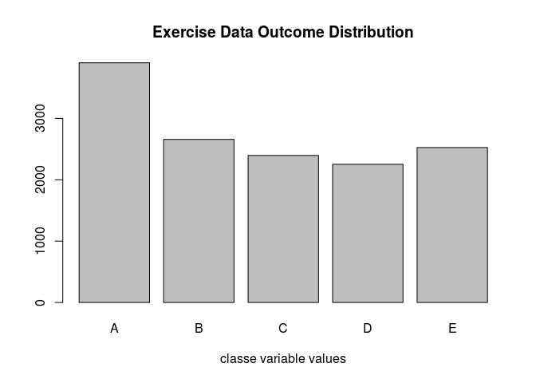
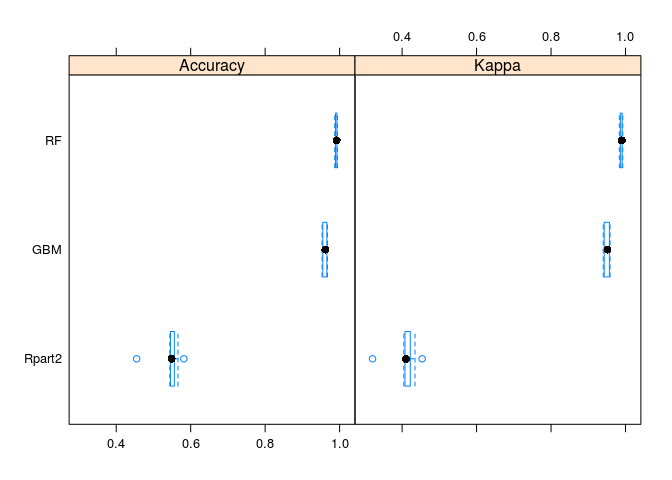
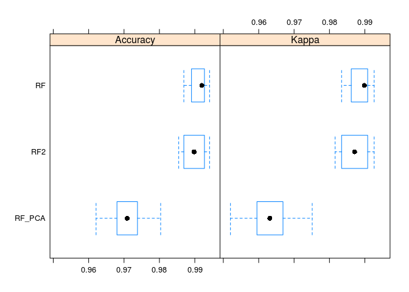

# Practical Machine Learning Project
Chris Hunter  
September 26, 2017  


## Synopsis
This analysis will take data from wearable accelerometers and attempt to accurately predict whether test subjects performed dumbbell lifts correctly.  If the exercise was not performed properly, it will also attempt to predict the incorrect manner in which it was done.  Six participants each wore accelerometers on their belt, forearm, arm, and the actual dumbbell.  Each participant performed a set of 10 repetitions of Unilateral Dumbbell Bicep Curls in five different ways using a 1.25kg weight.  This resulted in the classe variable in which a value of A represents the exercise being done correctly.  Each incorrect exercise was given another letter value. This included B – elbows to the front, C – lifting dumbell halfway, D – lowering dumbell halfway, and E – throwing hips to the front. 
    
    
## Data Analysis and Cleaning
This data set has many variables of type numeric or int that look like useful accelerometer stats.  There are also variables with predominantly NA values as well as factor variables with divide-by-zero errors and a lot of blank values.  The data will be first broken into training and test datasets. After that, all columns consisting of more than 90% NA or $DIV0 errors will be removed.  These 2 checks will remove all NA's as well as the excessive blanks.  Other variables that will not be useful will also be removed leaving actual measurements from the accelerometer and the outcome variable of classe.

```r
fulldata <- read.csv("/home/chris/pml-training.csv")

inTrain = createDataPartition(fulldata$classe, p = .70)[[1]]

training <- fulldata[inTrain,]
testing <- fulldata[-inTrain,]

train_na_cnt <- as.vector(0)
for(i in 1:NCOL(training)) {
    train_na_cnt[i] <- NROW(training[is.na(training[,i]),i])/NROW(training) > .90 |
                       any(training[,i] == "#DIV/0!")
}
train_no_na <- training[,!train_na_cnt]
train_fin <- train_no_na[,-c(1:7,37,38)] 

test_no_na <- testing[,!train_na_cnt]
test_fin <- test_no_na[,-c(1:7,37,38)]

plot(training$classe, xlab = "classe variable values")
title("Exercise Data Outcome Distribution")
```

<!-- -->
    
    
## Model Selection
Once the data is clean, several different models will be trained using 10 fold cross-validation to try and find the most accurate method.  With the outcome variable consisting of 5 possible letter values, the models used will be classification models.  These include a decision tree using the rpart2 method, random forest for ensembling many decision trees, and GBM for a boosting method.  


```r
cluster <- makeCluster(detectCores() - 1)
registerDoParallel(cluster)

seeds <- vector(mode = "list", length = 11)
for(i in 1:10) seeds[[i]]<- sample.int(n=1000, 3)
seeds[[11]]<-sample.int(1000, 1)
fit_ctrl <- trainControl(method = "cv", number = 10, seeds = seeds, allowParallel = TRUE)
```

```r
set.seed(123)
fit_ctrl <- trainControl(method = "cv", number = 10, seeds = seeds, allowParallel = TRUE)
fit_rpart2 <- train(classe ~ ., method="rpart2", data = train_fin, trControl=fit_ctrl)
pred_rpart2 <- predict(fit_rpart2, newdata = test_fin)
cm_rpart2 <- confusionMatrix(pred_rpart2, test_fin$classe)
```


```r
set.seed(123)
fit_ctrl <- trainControl(method = "cv", number = 10, seeds = seeds, allowParallel = TRUE)
capt <- capture.output(fit_gbm <- train(classe ~ ., method="gbm", data = train_fin,  trControl= fit_ctrl))
pred_gbm <- predict(fit_gbm, newdata = test_fin)
cm_gbm <- confusionMatrix(pred_gbm,test_fin$classe)
```


```r
set.seed(123)
fit_ctrl <- trainControl(method = "cv", number = 10, seeds = seeds, allowParallel = TRUE)
fit_rf <- train(classe ~ ., method="rf", data = train_fin, trControl= fit_ctrl)
pred_rf <- predict(fit_rf, newdata = test_fin)
cm_rf <- confusionMatrix(pred_rf,test_fin$classe)
```

     
## Model Training Accuracy

```r
result_train <- rbind(max(fit_rpart2$results$Accuracy), max(fit_rf$results$Accuracy),
                      max(fit_gbm$results$Accuracy))
rownames(result_train) <- c("Rpart2", "RF", "GBM")
colnames(result_train) <- c("Accuracy")
kable(result_train)
```

           Accuracy
-------  ----------
Rpart2    0.5443033
RF        0.9909006
GBM       0.9607632
     
The random forest model was clearly the most accurate with **0.991** training accuracy.  To try and improve on this number, a couple of other tuning options will be attempted.  First, the top 20 predictors will be determined and run through random forest again, followed by a repeat of random forest using PCA.        
    
## Results of Model Testing

```r
results <- rbind(cm_rpart2$overall, cm_rf$overall, cm_gbm$overall)
rownames(results) <- c("Rpart2", "RF","GBM")
kable(results)
```

           Accuracy       Kappa   AccuracyLower   AccuracyUpper   AccuracyNull   AccuracyPValue   McnemarPValue
-------  ----------  ----------  --------------  --------------  -------------  ---------------  --------------
Rpart2    0.5622770   0.4263253       0.5494887       0.5750035       0.284452                0               0
RF        0.9938828   0.9922618       0.9915411       0.9957120       0.284452                0             NaN
GBM       0.9668649   0.9580719       0.9619693       0.9712902       0.284452                0             NaN


## Comparison of Models
    
In this plot, the random forest model edges out the boosted model.

```r
resamp <- resamples(list(RF=fit_rf, GBM=fit_gbm,Rpart2=fit_rpart2))
bwplot(resamp)
```

<!-- -->

Find variables that were most important in predicting classe within the random forest algorithm.

```r
imp <- varImp(fit_rf)
print(imp)
```

```
## rf variable importance
## 
##   only 20 most important variables shown (out of 50)
## 
##                   Overall
## roll_belt         100.000
## pitch_forearm      59.773
## yaw_belt           56.968
## pitch_belt         47.514
## magnet_dumbbell_z  43.610
## roll_forearm       43.137
## magnet_dumbbell_y  42.550
## accel_dumbbell_y   25.574
## magnet_dumbbell_x  20.550
## accel_forearm_x    18.191
## roll_dumbbell      17.661
## accel_dumbbell_z   16.271
## magnet_belt_z      16.044
## magnet_forearm_z   15.050
## accel_belt_z       13.922
## magnet_belt_y      12.727
## yaw_arm            12.558
## magnet_belt_x      11.099
## gyros_belt_z       10.787
## roll_arm            9.002
```

   
Using most important variables, re-train the random forest model.

```r
set.seed(123)
fit_ctrl <- trainControl(method = "cv", number = 10, seeds = seeds, allowParallel = TRUE)
fit_rf2 <- train(classe ~ roll_belt + yaw_belt + magnet_dumbbell_z + magnet_dumbbell_y
                 + pitch_forearm + pitch_belt + roll_forearm + magnet_dumbbell_x +
                   accel_belt_z + accel_dumbbell_y + roll_dumbbell + magnet_belt_z+
                   magnet_belt_y + accel_dumbbell_z + roll_arm + accel_forearm_x +
                   yaw_dumbbell + gyros_dumbbell_y + gyros_belt_z + magnet_arm_y, 
                 method="rf", data = train_fin, trControl= fit_ctrl)
pred_rf2 <- predict(fit_rf2, newdata = test_fin)
```
   

Attempt random forest again using Principle Components Analysis.

```r
set.seed(123)
fit_ctrl <- trainControl(method = "cv", number = 10, seeds = seeds, allowParallel = TRUE)
preProc <- preProcess(train_fin, method = "pca")
train_pca <- predict(preProc, train_fin)
test_pca <- predict(preProc, test_fin)

set.seed(123)
fit_ctrl <- trainControl(method = "cv", number = 10, seeds = seeds, allowParallel = TRUE)
fit_rf_pca <- train(classe ~ ., method="rf", data = train_pca, trControl= fit_ctrl)
pred_rf_pca <- predict(fit_rf_pca, newdata = test_pca)

cm_rf2 <- confusionMatrix(pred_rf2,test_fin$classe)
cm_rf_pca <- confusionMatrix(pred_rf_pca,test_fin$classe)
```

## Results of Random Forest Tuning 
   
### Training Results

```r
result2_train <- rbind(max(fit_rf$results$Accuracy), max(fit_rf2$results$Accuracy),
                      max(fit_rf_pca$results$Accuracy))
rownames(result2_train) <- c("RF", "RF Most Imp", "RF PCA")
colnames(result2_train) <- c("Accuracy")
kable(result2_train)
```

                Accuracy
------------  ----------
RF             0.9909006
RF Most Imp    0.9899542
RF PCA         0.9707345
   
### Testing Results

```r
results2 <- rbind(cm_rf$overall, cm_rf2$overall, cm_rf_pca$overall)
rownames(results2) <- c("RF All","RF Most Imp", "RF PCA")
kable(results2)
```

                Accuracy       Kappa   AccuracyLower   AccuracyUpper   AccuracyNull   AccuracyPValue   McnemarPValue
------------  ----------  ----------  --------------  --------------  -------------  ---------------  --------------
RF All         0.9938828   0.9922618       0.9915411       0.9957120       0.284452                0             NaN
RF Most Imp    0.9933730   0.9916168       0.9909517       0.9952834       0.284452                0             NaN
RF PCA         0.9774002   0.9714134       0.9732729       0.9810442       0.284452                0             NaN
    
The model using the top 20 most important predictors provided just a slightly lower accuracy of  **0.994**.  Running random forest with PCA applied to these same predictors lowered the accuracy to **0.977**.
   

## Plot of Random Forest Tuning

```r
resamp <- resamples(list(RF=fit_rf, RF2=fit_rf2, RF_PCA=fit_rf_pca))
bwplot(resamp)
```

<!-- -->

```r
stopCluster(cluster)
registerDoSEQ()
```
## Summary
After comparing all models that were trained using 10 fold cross-validation, the random forest model proved the most accurate.  Further tuning of this model with the 20 most important predictors as well as Principle Component Analysis resulted in slightly lower accuracy from the training data.  After predicting using the testing data set, the random forest model using 10-fold CV and 50 variables from the accelerometer measurements proved to be the most accurate with **0.994** accuracy.  Based on these results we can expect about **0.006** out of sample error on future predictions.
However, it is important to note that the accuracy of the 2nd random forest using the top 20 most important variables only had **0.001** lower accuracy.  This could make this model more useful from a performance standpoint in a real life situation where performance may be worth the very small accuracy tradeoff.

